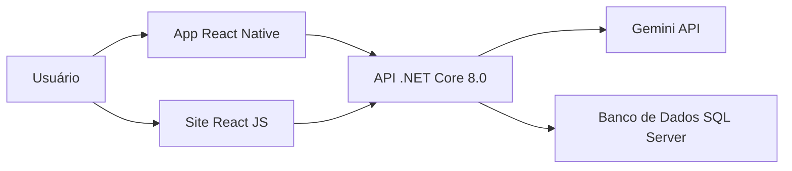

<h1 align="center">⚡ EnerCheck – Análise Inteligente de Projetos Elétricos</h1>

<p align="center">
  
  
  
  
</p>

---

## 🚀 Sobre o projeto

O **EnerCheck** é uma plataforma voltada para **engenheiros elétricos** que desejam **otimizar e reduzir custos em projetos elétricos** por meio de **análises inteligentes baseadas em IA (Gemini)**.  
O sistema foi desenvolvido como **projeto final** e conta com uma arquitetura completa e escalável — incluindo **site institucional**, **painel administrativo**, **aplicativo mobile** e **API em .NET**.

---

## 🧩 Estrutura do projeto

Este repositório contém o **monorepo principal** do EnerCheck, com os seguintes módulos:

| Módulo | Tecnologia | Descrição |
|:--|:--|:--|
| 🖥️ **Site Institucional** | React JS | Apresenta o produto, recursos, planos e informações gerais da EnerCheck. |
| ⚙️ **Painel Administrativo (Dashboard)** | React JS | Área para gerenciamento de usuários, análises e relatórios de projetos. |
| 📱 **Aplicativo Mobile** | React Native | Permite aos engenheiros realizarem análises rápidas e acessarem resultados via smartphone. |
| 🔌 **Backend API** | ASP.NET Core 8.0 | API responsável pela autenticação, controle de usuários, comunicação com o Gemini e armazenamento de dados. (Submódulo separado) |

---

## 🤖 Integração com Gemini

O EnerCheck utiliza a **API do Gemini (Google AI)** para processar e interpretar **plantas elétricas enviadas pelos usuários**.  
A IA realiza análises automáticas que:
- Identificam possíveis falhas ou inconsistências no projeto;
- Estimam o custo total de execução;
- Sugerem alternativas mais econômicas;
- Geram relatórios detalhados para o engenheiro responsável.

---

## ✨ Principais funcionalidades

✅ **Análise automática de plantas elétricas via IA**  
✅ **Cálculo de custo estimado e sugestões de otimização**  
✅ **Dashboard administrativo completo**  
✅ **Autenticação e controle de acesso**  
✅ **Histórico de análises e relatórios exportáveis**  
✅ **Aplicativo mobile com suporte offline e notificações**  
✅ **Design moderno e responsivo (React + Tailwind)**  
✅ **Arquitetura modular com backend desacoplado (.NET)**  

---

## 🛠️ Tecnologias utilizadas

### 🔹 Frontend Web
- React JS  
- Vite  
- BootStrap / BootStrap Icons
- Axios  
- React Router 

### 🔹 Mobile
- React Native  
- Expo  
- AsyncStorage  
- Axios  

### 🔹 Backend
- ASP.NET Core 8.0 (C#)  
- Entity Framework Core  
- SQL Server  
- JWT Authentication  
- Swagger  

### 🔹 Inteligência Artificial
- Google Gemini API  

---

## 📁 Estrutura de pastas

EnerCheckPrincipal/
├── FrontEnd/ # Dashboard administrativo (React JS)
├── FrontEnd-ADM/ # Site institucional (React JS)
├── Aplicativo/ # Aplicativo mobile (React Native)
├── EnerCheckAPI/ # Submódulo com a API em .NET
└── README.md # Este arquivo

---

## 🧠 Arquitetura geral


🧩 Como rodar o projeto localmente
1️⃣ Clonar o repositório principal
```bash
Copy code
git clone --recurse-submodules https://github.com/Brun0HM/EnerCheckPrincipal.git
```
2️⃣ Instalar dependências
```bash
cd EnerCheckPrincipal

# Site institucional
cd FrontEnd
npm install

# Dashboard admin
cd FrontEnd-ADM
npm install

# Aplicativo mobile
cd Aplicativo
npm install
```
3️⃣ Rodar cada módulo
```bash
# Site
npm run dev

# Admin
npm run dev

# Mobile
npm start
```
⚠️ O backend deve ser inicializado separadamente (ver README no submódulo /backend).

## 🧑‍💻 Desenvolvido por
<table align="center"> <tr> <td align="center"><br /><sub><b>Bruno Martins</b></sub><br />💻 Dev FullStack e Líder de projeto</td>
 <td align="center"><br /><sub><b>Thiago Mazzi</b></sub><br />💻 Dev FullStack</td>
 <td align="center"><br /><sub><b>Joaquim</b></sub><br />💻 Dev FullStack</td> 
 <td align="center"><br /><sub><b>Luiz Ghilherme </b></sub><br />💻 Dev FullStack</td> </tr>
 <td align="center"><br /><sub><b>Ryan Rattini </b></sub><br />💻 Web Designer e Dev FrontEnd </td> </tr>
</table>
🪪 Licença
Este projeto está sob a licença MIT – veja o arquivo LICENSE para mais detalhes.
